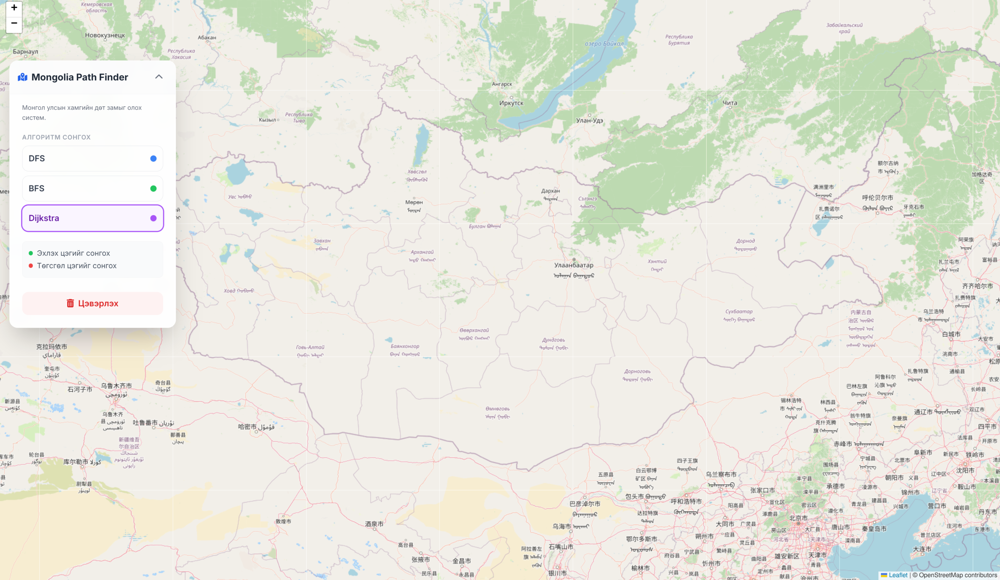
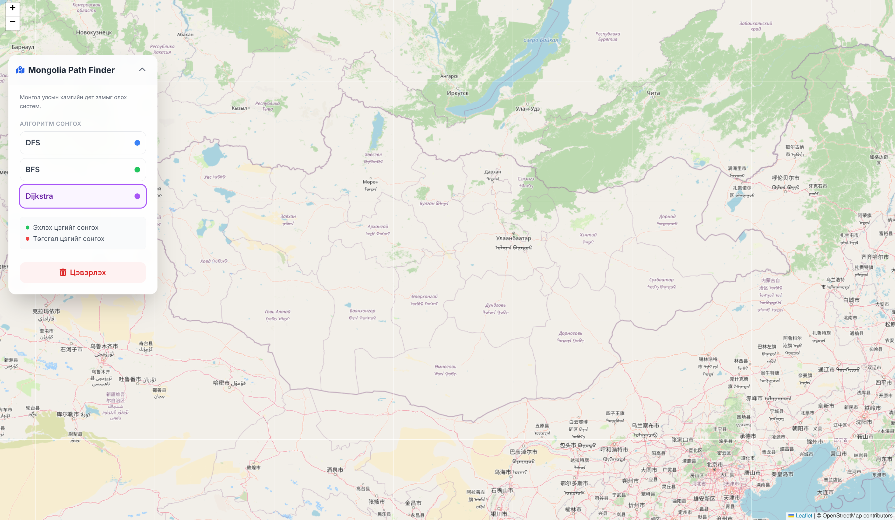

# Mongolia-road-Network

**Mongolia-road-Network** нь Монгол улсад хамгийн дөт замыг олох, визуализаци хийх систем юм. Энэ нь **Java Spring Boot** backend болон **Leaflet.js** frontend-ийг ашиглан бүтээгдсэн бөгөөд хэрэглэгчид газрын зураг дээр эхлэх ба төгсгөл цэгийг сонгож, замыг харах боломжтой.

---

## Функциональ боломжууд

- **Зам олох алгоритмууд**:
  - Dijkstra
  - DFS (Depth-First Search)
  - BFS (Breadth-First Search)
- **Замын шинж чанарыг харуулах**:
  - Замын төрөл (motorway, trunk, residential гэх мэт)
  - Хурдны хязгаар
  - Гүүр эсвэл хонгил байгаа эсэх
- **Өөрчлөгддөг frontend**:
  - Sidebar-ээс алгоритм сонгох
  - Эхлэх ба төгсгөл цэгийг сонгох
  - Замыг картад дүрслэх
- **Responsive дизайн**:
  - Leaflet газрын зураг
  - Tailwind CSS-ээр хялбар бөгөөд үзэмжтэй

---

## Технологи

- **Backend**:
  - Java 17
  - Spring Boot
  - GeoTools (Shapefile унших)
  - Haversine formula ашиглан зайг тооцоолох
- **Frontend**:
  - HTML/CSS/JS
  - Leaflet.js газрын зураг
  - Tailwind CSS
  - Font Awesome icons

---

## Суурилуулах

1. GitHub-аас репозиторыг clone хийнэ:

```bash
git clone https://github.com/yourusername/ub-shortest-path.git
cd ub-shortest-path
```
2. Maven ашиглан project-г build хийнэ:

```bash
./mvnw clean install
```
3. Төслийг ажиллуулна:

```bash
./mvnw spring-boot:run
```
4. Browser-ээс нээнэ:

```
http://localhost:8080
```

## Хэрэглэх заавар

1. Sidebar-ээс алгоритм сонгоно (DFS, BFS, Dijkstra).
2. Газрын зураг дээр эхлэх цэгийг сонгоно (ногоон цэг).
3. Төгсгөл цэгийг сонгоно (улаан цэг).
4. Систем автоматаар дээд хурд, гүүр болон замын төрөл зэргийг харгалзан хамгийн дөт замыг тооцоолж, картад дүрслэнэ.
5. Замыг цэвэрлэхийн тулд Цэвэрлэх товчийг дарна.

## Газрын зураг дээр замыг дүрслэх



## Замын өгөгдөл
Төслийн resources/data/ дотор gis_osm_roads_free_1.shp гэх Shapefile файл байгаа бөгөөд энэ нь OpenStreetMap замын өгөгдлийг агуулдаг.

## API
GET /path
| Параметр  | Төрөл             | Тайлбар                                          |
| --------- | ----------------- | ------------------------------------------------ |
| start_lat | double            | Эхлэх цэгийн latitude                            |
| start_lon | double            | Эхлэх цэгийн longitude                           |
| end_lat   | double            | Төгсгөл цэгийн latitude                          |
| end_lon   | double            | Төгсгөл цэгийн longitude                         |
| algo      | String (optional) | Алгоритм (dijkstra, dfs, bfs), default: dijkstra |

## License

MIT License
Copyright (c) 2025 Enkhbayar Munkbaatar

Энэхүү программыг ямар ч зорилгоор үнэгүй ашиглах, хуулбарлах, засварлах, түгээх, sublicence хийх, борлуулах эрхийг олгож байна. Программ нь "AS IS" буюу ямар ч баталгаагүйгээр хүргэгдэнэ. Үүнд худалдаа хийхэд тохиромжтой, тодорхой зорилготой байх, аливаа зөрчил гарахгүй байх баталгаа багтсангүй. Зохиогч эсвэл лиценз эзэмшигч нь аливаа хохирол, нэхэмжлэлд хариуцахгүй.
